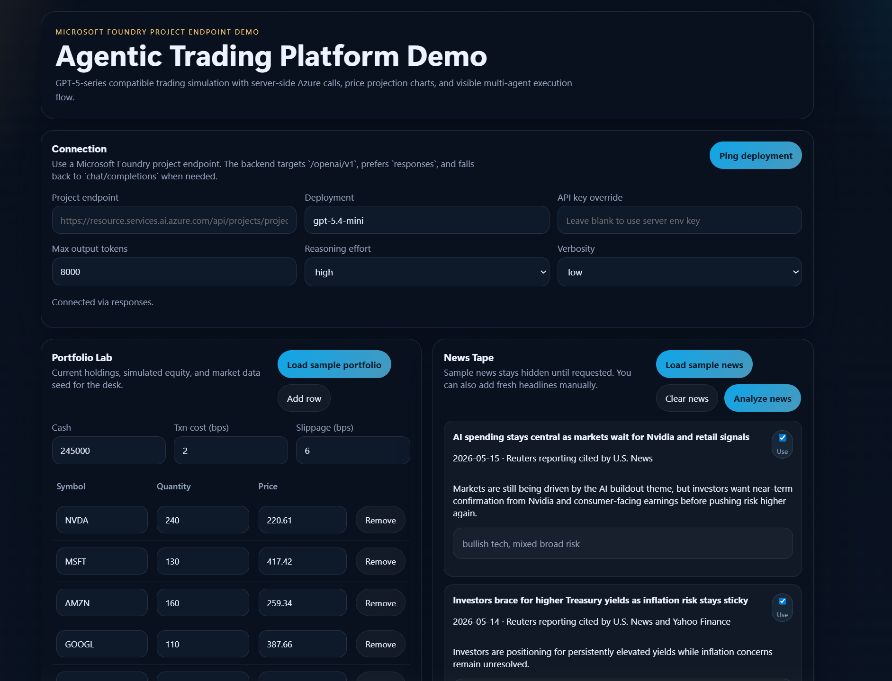
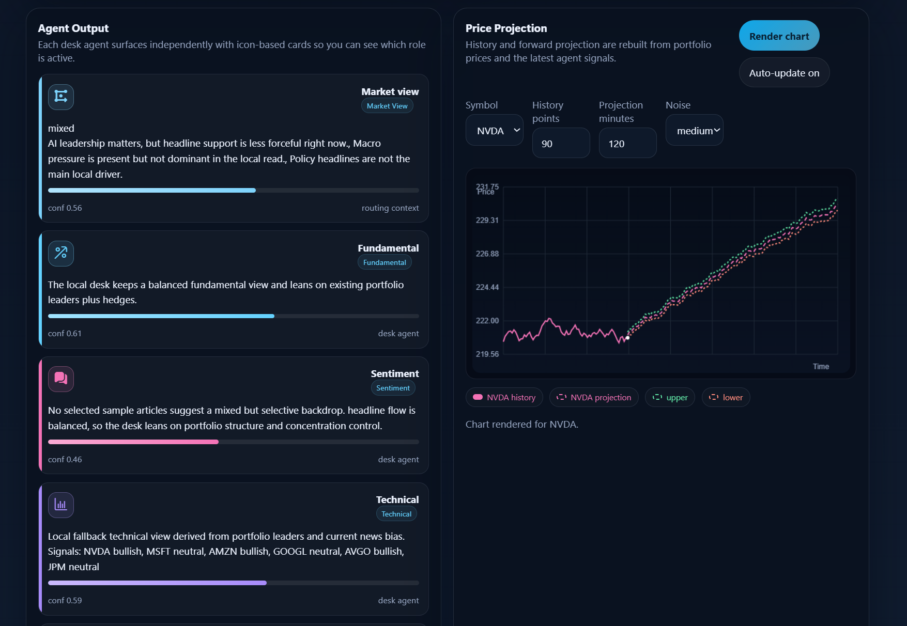
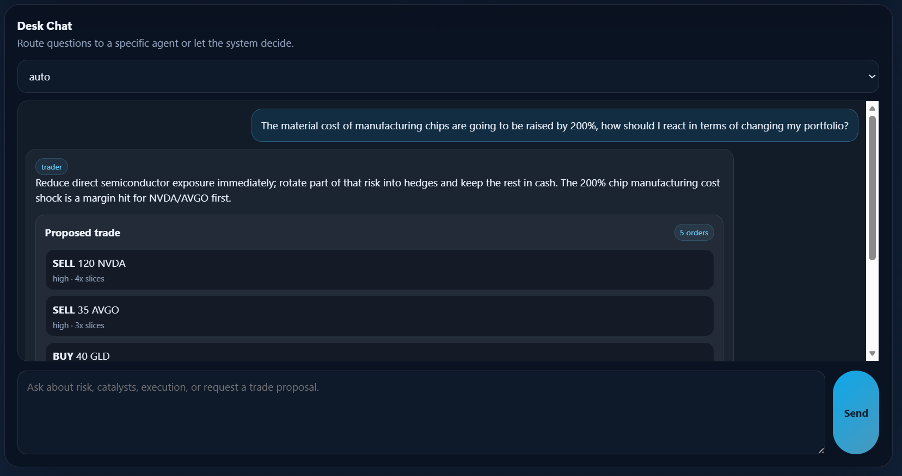

# Agentic Trading Platform Demo

Agentic Trading Platform Demo is a lightweight multi-agent trading desk simulator built around Microsoft Foundry project endpoints. It combines a browser UI, a small Node backend, GPT-5-series compatibility, local execution simulation, and demo-ready portfolio and news fixtures for showcasing an end-to-end agentic trading workflow.

## Screenshots

Store platform screenshots in `img/` and replace the placeholders below when you are ready to publish them.

Suggested image slots:

- `img/platform-overview.png`
- `img/news-and-proposal.png`
- `img/desk-chat.png`

Markdown template:

```md



```

## Features

- Microsoft Foundry project endpoint support with server-side API calls
- GPT-5-series support using `/responses` first and `/chat/completions` as a compatibility fallback
- Multi-agent desk flow across market, fundamental, sentiment, technical, risk, and trader roles
- Local fallback logic for news analysis, trader proposals, and desk chat when Foundry credentials are not configured
- Simulated order execution with slicing, slippage, transaction costs, and executed-trade tracking
- Built-in sample portfolio and sample news aligned to an AI-infrastructure-plus-hedges market posture
- Price-history and forward-projection charts driven by the portfolio and latest desk signals

## Project layout

- `public/`: frontend UI, desk controls, chat, charts, and proposal views
- `server.js`: local HTTP server and API routes
- `lib/foundry.js`: Foundry request handling and GPT-5-series compatibility logic
- `lib/prompts.js`: structured prompts for desk, news, and chat routes
- `lib/simulation.js`: execution simulator and portfolio summarization
- `data/`: sample portfolio and sample news fixtures
- `tests/`: lightweight Node test coverage for Foundry parsing and execution behavior

## Prerequisites

Before configuring the app, make sure you have:

- Node.js 20 or newer
- a Microsoft Foundry project endpoint
- an API key that can access that Foundry project
- a deployed model in the project that you want this app to call
- a local `.env` file created from `.env.example`

### Configure `.env`

Copy `.env.example` to `.env`, then fill in the required values:

```text
FOUNDRY_PROJECT_ENDPOINT=https://<resource>.services.ai.azure.com/api/projects/<project-name>
FOUNDRY_API_KEY=<key>
FOUNDRY_MODEL_DEPLOYMENT=<your-model-deployment-name>
```

Optional values:

```text
FOUNDRY_MAX_OUTPUT_TOKENS=8000
FOUNDRY_REASONING_EFFORT=medium
FOUNDRY_VERBOSITY=low
PORT=3000
```

The server appends `/openai/v1` to the project endpoint automatically.

### Start the app

```bash
npm start
```

Then open `http://127.0.0.1:3000`.

## Local demo mode

The app remains usable even without a configured API key or Foundry project endpoint. In local demo mode it can:

- load the sample portfolio
- load parked sample news on demand
- analyze selected news locally
- generate fallback trader proposals
- respond in desk chat with local agent logic
- simulate order execution and update charts

This makes the repository easier to share publicly without shipping secrets.

## Scripts

- `npm start`: run the local server
- `npm run dev`: run the local server in watch mode
- `npm run lint`: syntax-check the server, frontend, and library files
- `npm test`: run the Node test suite

## Demo flow

1. Load the sample portfolio.
2. Load sample news or add a custom market headline.
3. Click `Analyze news`.
4. Click `Run desk` to generate agent output and a trader proposal.
5. Execute the proposal from the blotter or directly from desk chat.
6. Review simulated fills, updated holdings, and chart projections.

## Publishing notes

- Do not commit `.env` or any real Foundry keys.
- This project is a simulator, not a brokerage integration.
- Sample news articles are testing fixtures, not a live market data feed.
- Values entered in the UI override server defaults for the current browser session only.
